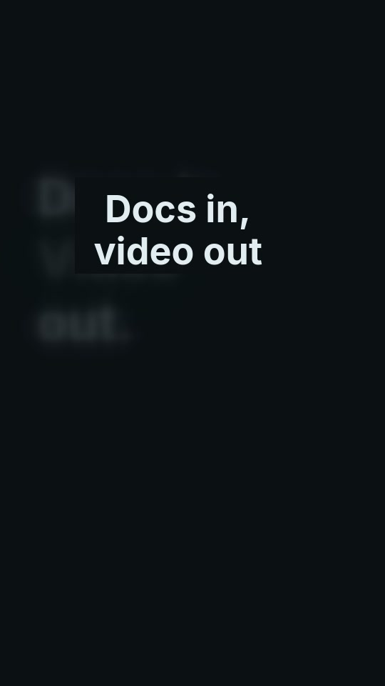

# video-studio

A Claude Code plugin that compiles knowledge into video. It turns text, URLs, documents or repos into a
finished, reproducible package: MP4, captions, thumbnail, social copy, manifest and provenance.
Claude writes the creative brief and scene spec. A bundled MCP server (`engine`) validates, persists,
routes, renders and runs QA. The plugin needs no LLM API key.

<p align="center"></p>

The reel in [`docs/media/hero.mp4`](docs/media/hero.mp4) was made by this plugin from this README
(animated-explainer archetype, technical style, local renderer).

## What it does (local tools only, no keys needed)

- **Create:** `/video-studio:create <file | URL | repo | folder of clips | idea>` runs:
  ingest → plan (brief, grounded spec, storyboard) → your approval → local render (preview,
  then final) → QA → per-platform packages. Every claim on screen cites the source.
- **Inputs:** text, Markdown, URLs, PDF, DOCX, PPTX, local repos, video and audio files, and
  folders of clips.
  - Speech is transcribed locally with whisper.cpp (the model download is opt-in) or imported
    from SRT/VTT.
  - `demo` records a scripted walk through an app you started (inputs are blurred).
- **Formats:**
  - 18 templates: explainers, listicles, product demo and UI, case study, before/after,
    carousel, text over music, talking head, aesthetic b-roll, silent vlog, oddly satisfying,
    ambient.
  - 15 scene kinds: typography, code, charts, stats, diagrams, timelines, quotes, split
    screens, lower thirds, kinetic text, maps and more.
  - Real footage, with fits, speed and text overlays.
  - 4 style packs, and brand kits.
- **Audio:**
  - System TTS or ElevenLabs, or no voice at all.
  - Bundled CC0 music beds with ducking under speech, beat-synced cuts, native clip sound,
    crossfades and sound effects.
  - Loudness normalised to -14 LUFS.
- **Platforms:** one `dist/<target>/` package per platform (TikTok, Instagram Reels, YouTube
  Shorts, LinkedIn, Facebook) with video, cover, captions, post copy and a QA report. Captions
  and text stay clear of each app's UI, checked by `lint` against versioned `platform-specs/`.
- **Languages:** `localize` makes Hindi, Japanese, Arabic and other language versions. It ships
  Noto fonts, CJK line breaking, right-to-left and shaped scripts, and per-language voices.
- **Trust:**
  - `verify` checks claim coverage.
  - `video.lock` pins every version and hash.
  - `test` compares golden frames and `diff` compares renders.
  - Provenance is recorded, and `export sign` adds optional C2PA content credentials.
- **Experiments:** `variants` builds hook × cover A/B sets; `adapt` changes the aspect ratio,
  length or platform; `shorts` cuts standalone clips from a long talk; `analyze` gives a
  reference video's structure.

Renderers: ffmpeg is built in. HyperFrames is an optional install for richer motion graphics.
Generative video providers (Runway, HeyGen, fal.ai) are planned for Phase 7 (see
`docs/PLAN.md`); until then such scenes render as placeholder cards.

## Install

Requires Node.js 22.13+ on `PATH` and, for rendering, a system FFmpeg built with libass and libx264
(macOS: `brew install ffmpeg`).

Local checkout:

```sh
claude --plugin-dir .
```

From the marketplace in this repo:

```
/plugin marketplace add <owner>/<repo>
/plugin install video-studio@video-studio-marketplace
```

Provider API keys (Runway, ElevenLabs, HeyGen, fal.ai, Kling) are optional. Set them in
`/plugin` → video-studio → Configure; they are stored in the OS credential store and passed only to
the MCP server's environment. Shell installs never prompt, so pass `--config KEY=VALUE` to
`claude plugin install` instead.

## Development

```sh
pnpm install
pnpm typecheck        # tsc -b
pnpm test             # vitest
pnpm schemas          # regenerate schemas/*.schema.json
pnpm bundle           # build dist/mcp.mjs (single-file ESM, committed)
pnpm smoke            # start dist/mcp.mjs over stdio and check its tool list
claude plugin validate --strict .claude-plugin/plugin.json   # plugin + skills
claude plugin validate --strict .                            # marketplace
```

Run the engine directly with `node dist/mcp.mjs`. It speaks MCP over stdio and logs to stderr.
After changing anything under `packages/`, rerun `pnpm bundle` and commit `dist/mcp.mjs`. CI fails
if the committed bundle or schemas are stale.

Layout:
- `packages/schema`: zod models and JSON Schemas.
- `packages/core`: project folders, cache, SQLite ledger and jobs.
- `packages/ingestion`: the extractors.
- `packages/media`: ffmpeg, audio, captions, QA, ASR and beats.
- `packages/renderer`: the ffmpeg, footage and HyperFrames renderers, tokens, styles and scripts.
- `packages/platforms`: platform contracts and zones.
- `packages/voice`: the TTS backends.
- `packages/mcp`: the MCP server, bundled to `dist/mcp.mjs`.
- Data: `skills/` (thin SKILL.md files), `templates/`, `styles/`, `music/`, `fonts/` and
  `platform-specs/`.

Contributor guides are in `docs/contributing/`.

## License

Apache-2.0. See `LICENSE`.
