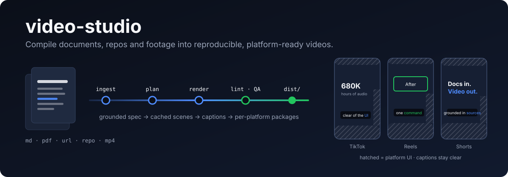
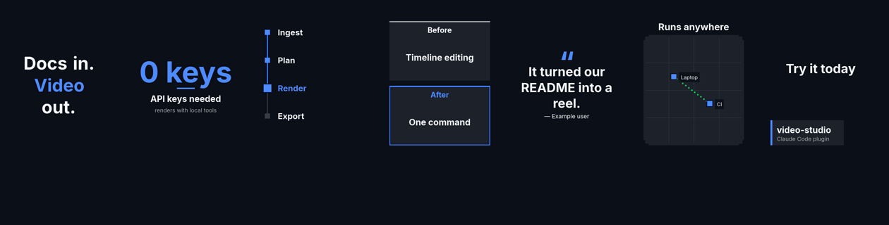
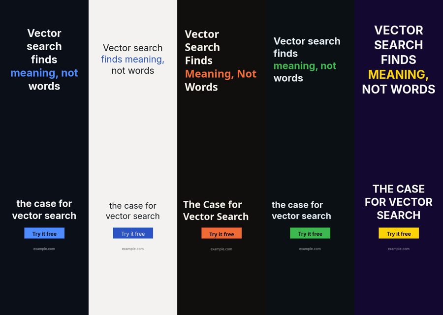
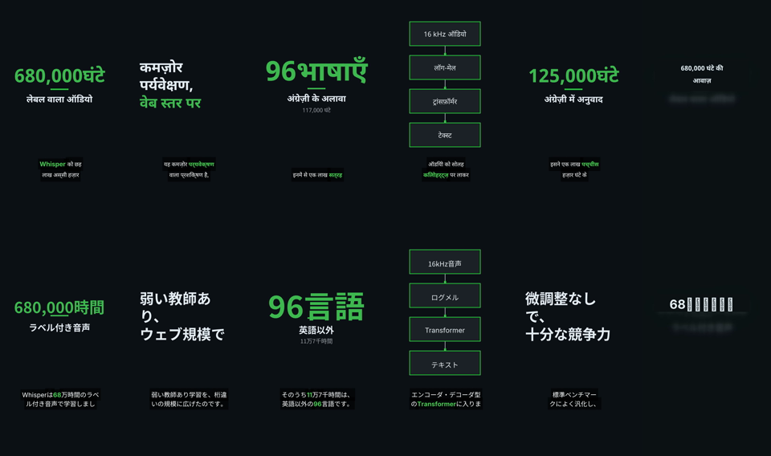
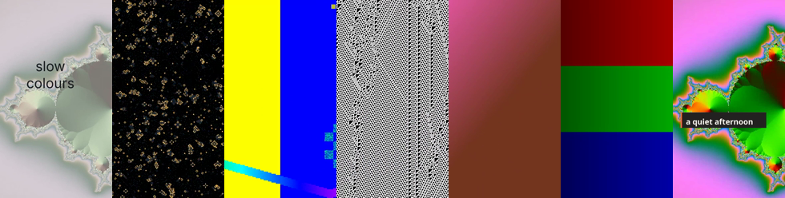
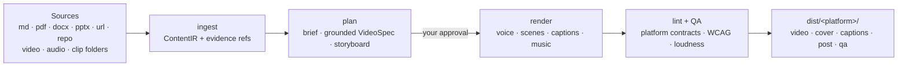

<div align="center">



<p>
  <a href="LICENSE"></a>
  
  
  
  
</p>

**Turn a README, a paper, a web page or a folder of clips into a finished, captioned short video, one package per platform, without leaving Claude Code.**

[See what it makes](#see-what-it-makes) · [Quick start](#quick-start) · [How it works](#how-it-works) · [Commands](#commands) · [Limits](#what-it-does-not-do-yet)

</div>

---

## Why

Turning knowledge into short videos usually means a timeline editor, a caption tool, a thumbnail tool and a checklist for every platform's safe zones and limits. **video-studio** compiles instead:

- **Grounded:** every claim on screen cites a line in your sources. `verify` shows what is covered.
- **Platform-ready:** one `dist/<platform>/` package each for TikTok, Instagram Reels, YouTube Shorts, LinkedIn and Facebook, with the video, cover, captions, post copy and a QA report. `lint` checks captions and text against each app's UI.
- **Reproducible:** `video.lock` pins every tool, font, renderer and asset hash. Re-renders are cached scene by scene, and `diff` and `test` catch regressions.
- **Local-first:** ffmpeg, system text-to-speech and local whisper.cpp. Claude writes the plan, so the plugin needs **no LLM API key**, and none of the features below need a paid service.

## See what it makes

All images below are frames from real renders made by the plugin during development, using the built-in ffmpeg renderer at preview size.

**This README as a reel.** [`docs/media/hero.mp4`](docs/media/hero.mp4) was made by the plugin from this README (animated-explainer template, `technical` style):

<p align="center"></p>

**15 scene kinds.** The strip shows kinetic text, a stat, a timeline, before/after, a quote, a map and a lower third, from a text-over-music reel with no voiceover:



**4 style packs, on the same content.** From left: the default, minimal, editorial, technical and energetic:



**Languages.** The Whisper paper (arXiv 2212.04356) as Hindi (top) and Japanese (bottom) versions made with `localize`: shaped Devanagari, Japanese line breaking and script-aware captions and covers:



**Your own footage.** A folder of clips cut to the beat of a bundled music bed, with text over the footage (`aesthetic-broll` and `silent-vlog`):



## Quick start

**Requirements:** Node.js 22.13+ and a system FFmpeg with libass and libx264 (`brew install ffmpeg` on macOS). Check with `/video-studio:doctor`.

```sh
git clone <this repo> video-studio
cd video-studio && pnpm install
claude --plugin-dir .
```

Then, inside Claude Code:

```
/video-studio:create README.md as a 30-second 9:16 reel for tiktok, instagram and youtube-shorts
```

Claude reads the source, proposes a hook, a scene plan and a storyboard, and waits for your **approval**. It then renders a preview, then the final, and writes the packages:

```text
dist/
├── reel.mp4  clean-master.mp4  captions.srt  captions.vtt  cover.jpg
├── video.lock  render-manifest.json  provenance.json  video-spec.json
├── tiktok/           video.mp4  cover.jpg  captions.*  post.json  qa.json
├── instagram/        …
└── youtube-shorts/   …
```

<details>
<summary>Install from a marketplace, and optional keys</summary>

```
/plugin marketplace add <owner>/<repo>
/plugin install video-studio@video-studio-marketplace
```

Provider keys (ElevenLabs, and later Runway, HeyGen, fal.ai) are optional. Set them in `/plugin` → video-studio → Configure. They are kept in the OS credential store and passed only to the plugin's MCP server.

</details>

## How it works



- **Claude is the creative engine.** Skills guide Claude to write the brief and the scene spec.
- **The engine does the rest.** A bundled MCP server validates, renders, runs QA and packages. It is deterministic, cached and has no LLM calls.
- **Three contracts connect the stages:**
  - `ContentIR`: the sources, with provenance.
  - `VideoSpec`: a provider-neutral scene graph.
  - `RenderManifest`: exactly what happened.

  Their JSON Schemas are in [`schemas/`](schemas/).
- **Platform facts are data**, not code: [`platform-specs/*.yaml`](platform-specs/) record each app's limits and UI masks, with a source URL and the date they were verified.

## What you can make

| | |
|---|---|
| **Inputs** | Markdown, text, PDF, DOCX, PPTX, web pages, local repos, video and audio files, folders of clips |
| **Templates (18)** | explain · educational · listicle · faceless-listicle · product-launch · devtool-launch · product-demo · product-ui · case-study · before-after · carousel-story · animated-explainer · text-over-music · talking-head · aesthetic-broll · silent-vlog · oddly-satisfying · ambient-slice-of-life |
| **Scene kinds (15)** | typography · code · chart · stat · diagram · timeline · comparison · split_screen · quote · kinetic_text · lower_third · map · screenshot · cta · end_card, plus real footage with text overlays |
| **Voice** | macOS `say` / espeak-ng, ElevenLabs (optional key), no voice (text over music), or the speech already in your footage |
| **Audio** | 4 bundled CC0 music beds (ducked under speech), beat-synced cuts, native clip sound, crossfades, sound effects, −14 LUFS |
| **Captions** | 3–7 word phrases on plates, placed clear of each platform's UI, with keyword emphasis and sound-event cues like `[music]` |
| **Looks** | Style packs (minimal, editorial, technical, energetic) and brand kits (colours, fonts, weights, motion, banned phrases) |
| **Languages** | `localize` translation sheets; bundled Noto fonts for Japanese, Devanagari and Arabic; CJK line breaking; right-to-left text |
| **Trust** | `verify` claim coverage, `video.lock`, golden-frame `test`, `diff`, provenance, optional C2PA content credentials (`export sign`) |

## Commands

| Command | What it does |
|---|---|
| `/video-studio:create` | The whole flow, from a source or an idea to packages, with an approval step |
| `/video-studio:plan` · `validate` | Brief, grounded spec and storyboard; explains every validation issue |
| `/video-studio:render` · `qa` · `export` | Local render (preview, then final), technical QA, per-platform packages (`sign` for C2PA) |
| `/video-studio:lint` · `verify` | Platform contract checks with a fix loop; claim coverage against the sources |
| `/video-studio:test` · `diff` | Golden-frame regression tests; spec, lock and frame diffs between renders |
| `/video-studio:variants` · `adapt` | Hook × cover A/B sets with an experiment manifest; new aspect, length or platform |
| `/video-studio:localize` | Language versions from a translation sheet, re-timed for the language |
| `/video-studio:ingest` · `shorts` · `analyze` | Media ingest and local transcription; standalone clips from a long talk; a reference video's format |
| `/video-studio:demo` | Records a scripted walk through **your** running app (inputs are blurred) |
| `/video-studio:doctor` | Checks ffmpeg, fonts, Chrome, whisper, HyperFrames and keys |

## What it does not do (yet)

- **No generative video or avatars yet.** Runway, HeyGen and fal.ai adapters are planned (Phase 7, needs keys). Until then those scenes render as titled placeholder cards. Sora is intentionally not supported.
- **No posting or analytics.** It produces packages and post copy; you upload them. Platform "trending sounds" are added in each app, and `post.json` reminds you of that.
- **HyperFrames is optional.** The built-in ffmpeg renderer covers every scene kind. The richer HyperFrames renderer needs its own install and Google Chrome.
- **The whisper model is downloaded only with your consent** (about 148 MB). You can supply SRT/VTT captions instead.
- **Demo capture never starts your app.** You start it and give the URL, and every step is approved first.

The roadmap is in [`docs/PLAN.md`](docs/PLAN.md) and the current state in [`docs/HANDOFF.md`](docs/HANDOFF.md).

<details>
<summary><b>Development</b></summary>

```sh
pnpm install
pnpm typecheck        # tsc -b
pnpm test             # vitest
pnpm schemas          # regenerate schemas/*.schema.json
pnpm bundle           # build dist/mcp.mjs (single-file ESM, committed)
pnpm smoke            # start dist/mcp.mjs over stdio and check its tools
claude plugin validate --strict .claude-plugin/plugin.json   # plugin + skills
claude plugin validate --strict .                            # marketplace
```

After changing anything under `packages/`, rerun `pnpm bundle` and commit `dist/mcp.mjs`.

| Package | Role |
|---|---|
| `packages/schema` | zod models → `schemas/*.schema.json` |
| `packages/core` | project folders, cache, SQLite ledger, jobs |
| `packages/ingestion` | extractors (documents, web, repos, media) |
| `packages/media` | ffmpeg, audio mix, captions, QA, ASR, beat detection |
| `packages/renderer` | ffmpeg, footage and HyperFrames renderers; tokens, styles, scripts |
| `packages/platforms` | platform contracts and layout zones |
| `packages/voice` | TTS backends |
| `packages/mcp` | the MCP server (`dist/mcp.mjs`) and every tool |

Data lives next to the code: `skills/`, `templates/`, `styles/`, `music/`, `fonts/` and `platform-specs/`.

</details>

## Contributing

Guides for adding [archetypes](docs/contributing/archetypes.md), [style packs](docs/contributing/styles.md), [platform packs](docs/contributing/platform-packs.md) and [providers](docs/contributing/providers.md) are in `docs/contributing/`. Ingested content is always treated as untrusted data: the plugin never executes code from sources.

## License

Apache-2.0. See [`LICENSE`](LICENSE). The bundled fonts are OFL-1.1 (see [`fonts/README.md`](fonts/README.md)), and the bundled music beds are CC0 (see [`music/README.md`](music/README.md)).
