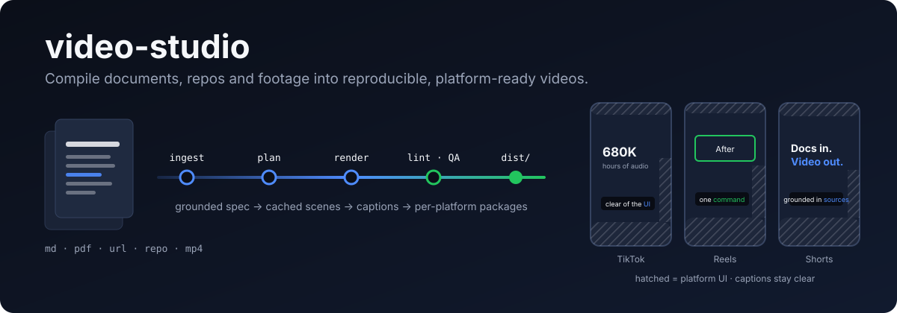
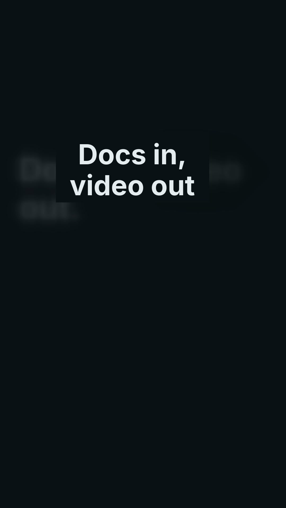
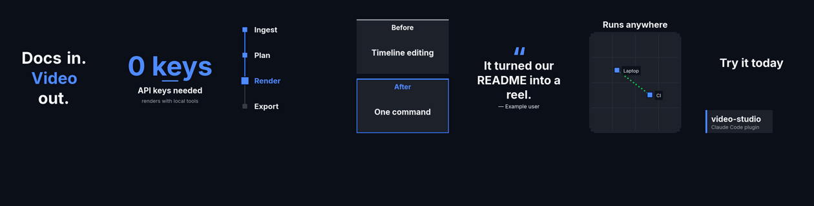
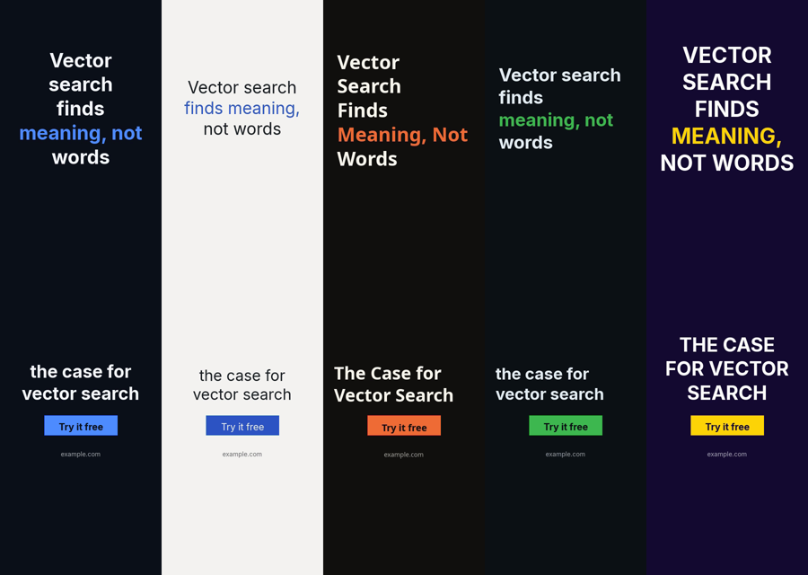
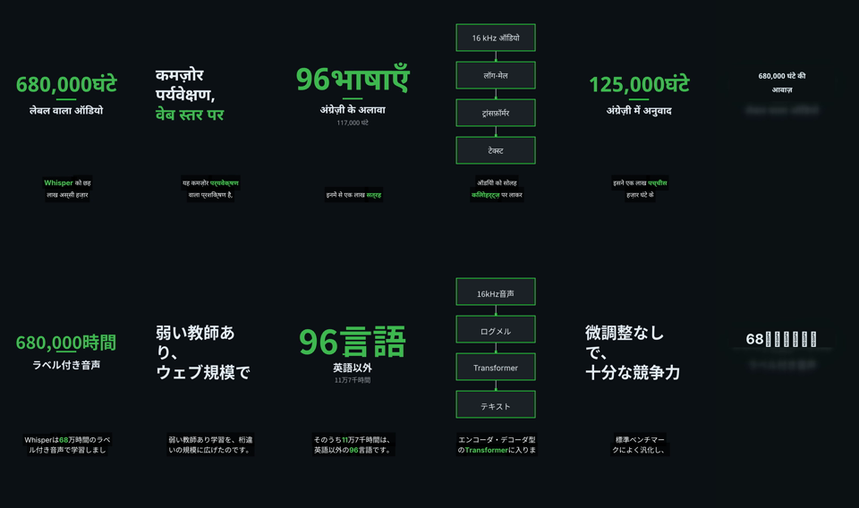
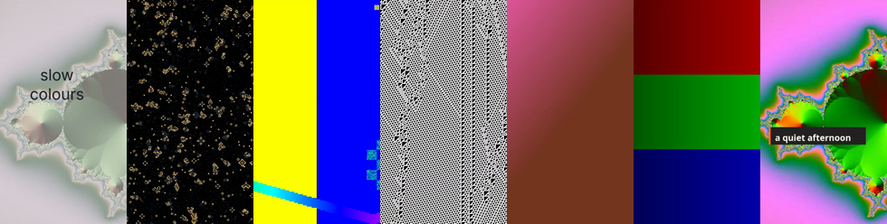
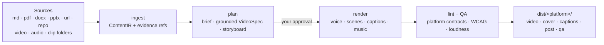

https://github.com/user-attachments/assets/d860c1b2-8653-455c-9bfa-640ad8a0b849

<div align="center">



<p>
  <a href="LICENSE"></a>
  
  
  
  
</p>

**Turn a README, a paper, a web page or a folder of clips into a finished, captioned short video, one package per platform, without leaving Claude Code.**

[Features](#features) · [See what it makes](#see-what-it-makes) · [Quick start](#quick-start) · [Requirements](#requirements) · [How it works](#how-it-works) · [Commands](#commands) · [Limits](#what-it-does-not-do-yet) · [What's new](CHANGELOG.md)

</div>

---

## Why

Turning knowledge into short videos usually means a timeline editor, a caption tool, a thumbnail tool and a checklist for every platform's safe zones and limits. **video-studio** compiles instead:

- **Grounded:** every claim on screen cites a line in your sources. `verify` shows what is covered.
- **Platform-ready:** one `dist/<platform>/` package each for TikTok, Instagram Reels, YouTube Shorts, LinkedIn and Facebook, with the video, cover, captions, post copy and a QA report. `lint` checks captions and text against each app's UI.
- **Made to be watched:** plans follow a story arc with timed "reads", each list item, step or number appears as the voice says it, and Claude reviews contact sheets of its own render before handing it over.
- **Works with real footage:** ingest recordings or YouTube/Vimeo/Loom links, transcribe them locally in ~99 languages, find the best short clips, keep a moving speaker in frame for vertical video, cut away to graphics while they talk, and trim pauses and filler words.
- **You stay in control:** Claude proposes and waits for your approval; paid voices, model downloads and screen recordings ask you through Claude Code's approval dialog and follow your `policy.yaml` spend limits; renders can be cancelled.
- **Reproducible:** `video.lock` pins every tool, font, renderer and asset hash. Re-renders are cached scene by scene, and `diff` and `test` catch regressions.
- **Local-first:** ffmpeg, system text-to-speech and local whisper.cpp. Claude writes the plan, so the plugin needs **no LLM API key**, and none of the features below need a paid service.

## Features

**Highlights**

- 🎬 **Motion written as code.** Claude can write a scene as an HTML page drawn by a pure `seek(t)` function: springs, morphs, match cuts and kinetic type at the level of hand-made motion design. Every page runs under a strict security policy, is checked for unsafe code before it renders, and is proven deterministic (the same time always draws the same frame).
- 📏 **Pacing you can measure.** QA counts big visual changes per second, the longest still stretch and frozen time, and fails a slideshow-paced reel. Vague asks like "make it pop" become acceptance numbers the render must meet, and `compare` scores your render against a reference video you like.
- 🎯 **Style from a reference reel.** `analyze` measures how a reel you like moves (entrance times, easing, stagger, holds) without keeping anything from it, and `write_style` turns that into a style pack in your project.
- 🚀 **Launch videos in one command.** `/video-studio:launch` turns your repo or site into an 18–22 s reel of the product in use, in its own colours, fonts and logo (drafted from the source for you to accept), with a synthesized score, sound effects and a poster on frame 0 for chat previews. One approval, after the preview.
- 🎵 **Music that drives the cut.** Beat analysis finds beats, downbeats and the drop; cuts snap to them and sound effects land on their peak. No track? `synth:` scores are composed locally, CC0, with an exact beat grid.
- 📱 **One source, every platform.** Per-platform packages (video, cover, captions, post copy, QA) for Instagram Reels, YouTube Shorts, TikTok, LinkedIn and Facebook, with text and captions kept clear of each app's UI.
- ✅ **Grounded and reproducible.** Every on-screen claim cites your sources (`verify`), `video.lock` pins every tool and asset, and scenes re-render only when something they use changes.
- 🔒 **Local-first, no keys needed.** ffmpeg, system voices and local whisper. Claude writes the plan, so there is no LLM API key; paid providers are optional placeholders until you add keys.

**Everything it does**

| Area | Features |
|---|---|
| **Sources** | Markdown, text, PDF, DOCX, PPTX, web pages, local repos, video/audio files, clip folders, video URLs (YouTube, Vimeo, Loom via your `yt-dlp`) |
| **Planning** | Story-arc plans with hooks and a hook-strength check, 24 templates that ask for the inputs they need first, a beat-level plan at the approval step, series bibles for recurring characters and looks, A/B `variants` (hooks, covers, 15 s / 30 s cuts) |
| **Visuals** | 16 scene kinds including Claude-written `motion` pages, 4 style packs with banned-effect lists plus project styles measured from a reference reel, brand kits, camera moves, transitions, word cues that land graphics on spoken words, count-ups, optional motion blur |
| **Review before render** | `stills` sheets at chosen times, beats or downbeats; a determinism and loop-seam check for every `motion` page |
| **Audio** | System TTS or ElevenLabs, 4 CC0 beds plus locally synthesized scores, beat and downbeat snapping, a synthesized CC0 sound-effect library, sound effects on their peak, motion that reacts to the music, ducking, −14 LUFS |
| **Footage** | Local transcription (~99 languages, speaker turns) with a glossary for names, best-clip `shorts`, subject tracking for vertical reframes, cutaways, `tighten` for pauses and filler words (paced like your own edits, every join checked for clipped words), redaction, letterbox removal |
| **Captions and languages** | Phrase captions clear of platform UI, keyword emphasis, sound-event captions, `localize` with Devanagari, Japanese and Arabic fonts, RTL and CJK line breaking |
| **Checks** | 30+ lint rules (UI zones, contrast, reading speed, caption sync, insert timing, cuts on the beat, story arc, title length, brand rules, banned effects, acceptance numbers, loop seams, unsafe motion pages), technical QA (loudness, black, frozen, motion density, loop seam, flashing, A/V sync), `review` contact sheets, `compare` against a reference |
| **Export** | Per-platform packages, C2PA signing, and an editable timeline (import-tested) for DaVinci Resolve or Final Cut (FCPXML and OTIO) |
| **Trust and control** | Claim `verify`, `video.lock`, golden-frame `test`, `diff`, provenance, optional C2PA signing, `policy.yaml` spend limits and consent, `render_cancel` |
| **Generative (prep)** | Shot cards compiled into ready-to-paste prompt packs for Seedance, Veo, Kling, Wan, Runway and Hailuo, offline with no spend; provider and publishing keys are optional placeholders until Phase 7/9 |

## See what it makes

Everything below was made by the plugin itself: no hand editing.

**This README as a reel.** [`docs/media/hero.mp4`](docs/media/hero.mp4) is a narrated 1080×1920 final render made from this README. It uses the animated-explainer structure, the `technical` style and a macOS Premium voice, and every line cites a README line. The project that makes it is [`examples/readme-hero`](examples/readme-hero):

<p align="center"></p>

The strips below are frames from preview renders (built-in ffmpeg renderer) made during development.

**Built-in scene kinds.** The strip shows kinetic text, a stat, a timeline, before/after, a quote, a map and a lower third, from a text-over-music reel with no voiceover:



**4 style packs, on the same content.** From left: the default, minimal, editorial, technical and energetic:



**Languages.** The Whisper paper (arXiv 2212.04356) as Hindi (top) and Japanese (bottom) versions made with `localize`: shaped Devanagari, Japanese line breaking and script-aware captions and covers:



**Your own footage.** A folder of clips cut to the beat of a bundled music bed, with text over the footage (`aesthetic-broll` and `silent-vlog`):



## Quick start

**Requirements:** Claude Code, Node.js 22.13+ and FFmpeg (`brew install ffmpeg` on macOS). Nothing else is required: the engine is a single bundled file. See [Requirements](#requirements) for the full list, and check your machine with `/video-studio:doctor`.

Inside Claude Code:

```
/plugin marketplace add harshil-1411/claude_plugin_video_studio
/plugin install video-studio@video-studio-marketplace
```

Then:

```
/video-studio:create README.md as a 30-second 9:16 reel for instagram and youtube-shorts
```

Claude reads the source, proposes a hook, a scene plan and a storyboard, and waits for your **approval**. It then renders a preview, looks at it, then the final, and writes the packages:

```text
dist/
├── reel.mp4  clean-master.mp4  captions.srt  captions.vtt  cover.jpg
├── video.lock  render-manifest.json  provenance.json  video-spec.json
├── instagram/        video.mp4  cover.jpg  captions.*  post.json  qa.json
└── youtube-shorts/   …
```

<details>
<summary>Optional extras: natural voices, HyperFrames, video URLs, local transcription</summary>

- **Voice:** macOS picks your best installed voice (add a Premium voice in System Settings → Accessibility → Spoken Content). An ElevenLabs key (`/plugin` → video-studio → Configure, stored in the OS credential store) is used only when your `policy.yaml` allows it or you ask for it.
- **HyperFrames renderer (needed for `motion` scenes):** install Google Chrome, then run `/video-studio:doctor`: it prints the one-time install command (the pinned `@hyperframes/producer`, installed into the plugin's data folder) and confirms Chrome starts. Nothing is installed until you run it. Without HyperFrames, every scene kind still renders with ffmpeg, but a `motion` scene appears as a labelled text stand-in and the render says so.
- **Video URLs:** `brew install yt-dlp` to ingest YouTube, Vimeo or Loom videos (subtitles become the transcript).
- **Transcription:** whisper.cpp (`brew install whisper-cpp`); models are downloaded only after you approve.

</details>

<details>
<summary>API keys (all optional)</summary>

Nothing needs a key. `/plugin` → video-studio → Configure shows these fields; secrets are kept in the OS credential store and only reach the engine, never a shell:

| Kind | Keys |
|---|---|
| In use today | ElevenLabs (voiceover), used only when your `policy.yaml` allows it or you ask for it |
| Placeholders for Phase 7 (AI video) | Runway, HeyGen, fal.ai, Kling, Google Gemini (Veo), BytePlus ModelArk (Seedance), Alibaba DashScope (Wan), MiniMax (Hailuo) |
| Placeholders for Phase 9 (publishing) | YouTube client ID and secret, Meta (Instagram) token, LinkedIn token, TikTok client key and secret |

Placeholders can be filled in any time; they have no effect until their integration ships. `/video-studio:doctor` shows which keys are set, never their values.

</details>

<details>
<summary>Recipe: match a reel you like</summary>

1. Give Claude the reference video with your source: `/video-studio:create my-notes.md as a 20-second 9:16 reel that feels like reference.mp4`. The plan skill asks for a reference, a photo and your brand first, and turns "make it feel like this" into acceptance numbers (big changes per second, frozen %, holds).
2. `/video-studio:analyze reference.mp4 write_style ref-look` measures the reference's motion timing (entrance length, easing, stagger, holds) and saves it as a style pack in your project. Only timing is kept, never its words, frames or audio.
3. After the preview render, `/video-studio:stills` shows each scene on the beats before the final render, and `/video-studio:compare` scores your render against the reference (frozen %, changes per second, cut rate, loudness).
4. QA fails a render that misses the acceptance numbers, so a slideshow-paced reel cannot pass silently.

</details>

<details>
<summary>Run from a clone (development)</summary>

```sh
git clone https://github.com/harshil-1411/claude_plugin_video_studio.git video-studio
cd video-studio && pnpm install
claude --plugin-dir .
```

</details>

## Requirements

`/video-studio:doctor` checks all of this on your machine and says exactly what is missing and how to fix it.

**Operating system**

| OS | Status |
|---|---|
| **macOS** (Apple silicon or Intel) | Fully supported and tested. Everything works, including macOS voices and automatic subject tracking (Apple Vision). |
| **Linux** | Supported. Voice uses `espeak-ng`; subject tracking is done by Claude from shot sheets instead of automatically. |
| **Windows** | Not tested. There is no built-in system voice (use no voice or ElevenLabs), and Chrome is not found automatically (set `CHROME_PATH`). WSL2 with Linux is the safer route. |

**Required software**

| Tool | Why | Install (macOS) |
|---|---|---|
| [Claude Code](https://claude.com/claude-code) | Hosts the plugin; Claude writes the plans and pages | see the Claude Code docs |
| Node.js **22.13+** | Runs the engine (it uses Node's built-in SQLite) | `brew install node` |
| FFmpeg and ffprobe, with **libx264** and **libass** | Every render, caption burn-in and QA check. libass (with fribidi) is needed for Arabic, Hebrew and Devanagari captions | `brew install ffmpeg` |

**Optional software** (each unlocks one feature; nothing is installed for you)

| Tool | Unlocks |
|---|---|
| Google Chrome + the HyperFrames producer | `motion` scenes (Claude-written code), richer motion graphics, `stills`, and the determinism check. `doctor` prints the one-time install command |
| whisper.cpp (`brew install whisper-cpp`) + a model (about 148 MB; 488 MB for speaker turns, downloaded only with your approval) | Transcribing your footage, `shorts`, `tighten`, and exact word timings for system voices |
| yt-dlp (`brew install yt-dlp`) | Ingesting YouTube, Vimeo and Loom links |
| A macOS Premium or Enhanced voice (System Settings → Accessibility → Spoken Content) | Natural-sounding narration with the free system voice |
| An ElevenLabs API key | Premium voiceover (optional and policy-gated; see API keys below) |
| FFmpeg with `zscale` (libzimg) | Tone-mapping HDR phone footage (without it HDR passes through with a warning) |

**Hardware**

| | Minimum | Recommended |
|---|---|---|
| CPU | Any 64-bit CPU | 4+ cores (scenes render in parallel, up to 2 at once) |
| Memory | 8 GB | 16 GB. Each parallel scene render wants about 1.5 GB free, and HyperFrames runs Chrome |
| Disk | About 25 MB for the plugin | 1–2 GB free for your projects, caches and optional whisper models. A 20 s 1080p reel project is about 50 MB, and the shared cache grows by a few hundred MB over many projects |
| GPU | Not needed | Not needed: everything renders on the CPU |
| Internet | Only to install the plugin | Only for URL ingest, optional downloads, and paid providers you enable |

## How it works


```mermaid
flowchart LR
  A["Sources<br/>md · pdf · docx · pptx · url · repo<br/>video · audio · clip folders"] --> B["ingest<br/>ContentIR + evidence refs"]
  B --> C["plan<br/>brief · grounded VideoSpec · storyboard"]
  C -->|your approval| D["render<br/>voice · scenes · captions · music"]
  D --> E["lint + QA<br/>platform contracts · WCAG · loudness"]
  E --> F["dist/&lt;platform&gt;/<br/>video · cover · captions · post · qa"]
```

- **Claude is the creative engine.** Skills guide Claude to write the brief and the scene spec.
- **The engine does the rest.** A bundled MCP server validates, renders, runs QA and packages. It is deterministic, cached and has no LLM calls.
- **Three contracts connect the stages:**
  - `ContentIR`: the sources, with provenance.
  - `VideoSpec`: a provider-neutral scene graph.
  - `RenderManifest`: exactly what happened.

  Their JSON Schemas are in [`schemas/`](schemas/).
- **Facts are data**, not code: [`platform-specs/*.yaml`](platform-specs/) record each app's limits and UI masks, and [`provider-specs/*.yaml`](provider-specs/) each AI video model family's limits and prompt syntax, with source URLs and the date they were checked.

## What you can make

| | |
|---|---|
| **Inputs** | Markdown, text, PDF, DOCX, PPTX, web pages, local repos, video and audio files (local transcription in English or ~99 languages with detection, optional speaker turns for English conversations), folders of clips, video URLs (YouTube, Vimeo, Loom through your own optional `yt-dlp`, using their subtitles when present; direct .mp4/.mp3 links need nothing extra) |
| **Templates (24)** | explain · educational · listicle · faceless-listicle · product-launch · devtool-launch · product-demo · product-ui · case-study · before-after · carousel-story · animated-explainer · text-over-music · talking-head · aesthetic-broll · silent-vlog · oddly-satisfying · ambient-slice-of-life · ui-morph-loop · kinetic-type · ambient-loop · slides-narrated · topic-explainer-9 · product-hero; templates can ask for the inputs they need first (reference video, photo, real UI states) |
| **Scene kinds (16)** | typography · code · chart · stat · diagram · timeline · comparison · split_screen · quote · kinetic_text · lower_third · map · screenshot · cta · end_card, plus **`motion`**: a page Claude writes as code (`seek(t)`, springs, the brand tokens and the music's beat grid), checked for safety and determinism before it renders, with optional motion blur; plus real footage with text overlays |
| **Voice** | macOS `say` (automatically picks an installed Premium/Enhanced voice; with local whisper installed its word timings are aligned to the audio, so captions and cues land exactly) or espeak-ng, ElevenLabs (optional key), no voice (text over music), or the speech already in your footage; pace set with `voice.rate_wpm` (default 160) |
| **Audio** | 4 bundled CC0 music beds (ducked under speech), locally synthesized scores (`synth:pulse`, `lofi`, `ambient`, `drive`: CC0, exact beat grid), cuts snapped to beats or downbeats, native clip sound, crossfades, sound effects placed on their peak, −14 LUFS with true-peak headroom |
| **Footage** | Crop, contain or blurred-pad fits, trim and speed, text overlays, automatic removal of baked-in letterbox bars, and `redact` regions to blur inboxes, names or dashboards in screen recordings; subject tracking that keeps a moving speaker in frame when a landscape video becomes vertical (`footage_focus`, macOS Vision); `footage_look` shot sheets so Claude sees the footage before choosing clips; cutaways from a talking head to a graphic while the speaker keeps talking; a brand or series glossary that fixes misheard names in transcripts and captions; `tighten` paced from a video you edited, with every cut checked for clipped or repeated words; quality warnings (dark or bright picture, clipped or unclear audio); rotated phone video and HDR handled |
| **Captions** | 3–7 word phrases on plates, placed clear of each platform's UI, held long enough to read, broken at speaker changes, with keyword emphasis and sound-event cues like `[music]`; turn them off per scene where kinetic text already shows the words |
| **Looks** | Style packs (minimal, editorial, technical, energetic, or your own in `<project>/styles/`, e.g. measured from a reference reel by `analyze write_style`) and brand kits (colours, fonts, weights, motion, a corner logo, forbidden treatments, banned phrases, pronunciation overrides such as `LLM` → "L L M" that keep captions as written); scene transitions (crossfade, fade to black, slide, zoom, whip) that keep narration in sync; per-scene camera moves (push in, pull out, punch, reveal, drift, hold); word cues that land each list item, step or number on the word that says it |
| **Languages** | `localize` translation sheets; bundled Noto fonts for Japanese, Devanagari and Arabic; CJK line breaking; right-to-left text |
| **Checks** | 30+ lint rules (platform UI zones, contrast, reading speed, caption timing, cues, data inserts on the words that say them, story arc, cutaway rhythm, title length (a heuristic), brand rules, banned effects, acceptance numbers, loop seams, footage quality), technical QA (loudness, black or frozen frames, motion density, flashing (approximates WCAG 2.3.1; red flashes not measured), A/V sync), `stills` sheets before a render, `review` contact sheets with problem scenes bordered, an automatic review → fix → re-render loop, and `compare` before/after pages or against a reference video with metrics |
| **Trust** | `verify` claim coverage, `video.lock`, golden-frame `test`, `diff`, provenance, optional C2PA content credentials (`export sign`); secrets found in sources are redacted |
| **Control** | `policy.yaml` (allowed providers, spend limits, approval threshold), consent recorded in `project/consent.json`, `render_cancel`, one render per project at a time |

## Examples

| Example | What it shows |
|---|---|
| [`examples/readme-hero`](examples/readme-hero) | The narrated hero reel above, grounded in a README snapshot |
| [`examples/text-to-motion-graphic`](examples/text-to-motion-graphic) | A 30 s explainer from Markdown notes (also the golden-frame test) |
| [`examples/reel-grammar`](examples/reel-grammar) | Every Phase 5 scene kind, the `energetic` style and a music bed, with no voiceover |
| [`examples/code-motion-loop`](examples/code-motion-loop) | A 6 s seamless UI-morph loop written as a `motion` page on a synthesized score, cut to downbeats (needs HyperFrames) |
| [`examples/demo-app`](examples/demo-app) | A tiny web app to try `/video-studio:demo` screen recording on |

## Commands

| Command | What it does |
|---|---|
| `/video-studio:create` | The whole flow, from a source or an idea to packages, with an approval step |
| `/video-studio:launch` | A short launch reel of something you built, from its repo or URL: the product in use, its own brand, one approval after the preview |
| `/video-studio:plan` · `validate` | Brief, grounded spec and storyboard, built on a story arc (hook, open loop, escalation, payoff, CTA); explains every validation issue |
| `/video-studio:render` · `qa` · `export` | Local render (preview, then final; cancel anytime), technical QA (including flashing and A/V sync), per-platform packages (`sign` for C2PA; `timeline` for a DaVinci Resolve or Final Cut project) |
| `/video-studio:lint` · `verify` | Platform contract checks with a fix loop (UI zones, caption readability and sync, cuts on the beat, story arc); claim coverage against the sources |
| `/video-studio:stills` | Frames of each scene at chosen times, beats or downbeats, before the full render |
| `/video-studio:prompt-pack` | Prompts for Seedance, Veo, Kling, Wan, Runway and Hailuo compiled from shot cards (offline: nothing generated or spent) |
| `/video-studio:review` · `compare` | Contact sheets, frame strips and crops of a render (lint findings bordered), so Claude looks at the video before handing it over; a before/after page that plays two versions in sync (side by side, stacked or wipe) |
| `/video-studio:test` · `diff` | Golden-frame regression tests; spec, lock and frame diffs between renders |
| `/video-studio:variants` · `adapt` | Hook × cover A/B sets with an experiment manifest; new aspect, length or platform |
| `/video-studio:localize` | Language versions from a translation sheet, re-timed for the language |
| `/video-studio:ingest` · `shorts` · `analyze` | Documents, web pages, repos, media files and video URLs; local transcription (language detection, speaker turns); standalone clips from a long talk, with shot sheets, subject tracking and cutaways; a reference video's format, motion timing and speech pacing (`write_style` saves the timing as a project style) |
| `/video-studio:tighten` | Cleans up talking-head footage: shortens pauses (optionally paced like a video you edited), cuts filler words and drops retakes, and checks every join for clipped words (dry run first, new asset on apply) |
| `/video-studio:demo` | Records a scripted walk through **your** running app (inputs are blurred) |
| `/video-studio:doctor` | Checks ffmpeg, fonts, Chrome, whisper, HyperFrames and keys |

## What it does not do (yet)

- **No generative video or avatars yet.** Adapters are planned (Phase 7, needs keys; the key fields already exist in Configure and do nothing until then). Until then those scenes render as titled placeholder cards, and `prompt_pack` writes ready-to-paste prompts for each generator. Sora is intentionally not supported.
- **No posting or analytics.** It produces packages and post copy; you upload them. Platform "trending sounds" are added in each app, and `post.json` reminds you of that.
- **HyperFrames is optional, except for `motion` scenes.** The built-in ffmpeg renderer covers every other scene kind. `motion` pages (Claude-written code) need HyperFrames and Google Chrome; without them they render as a reported text stand-in.
- **Some checks are approximations.** Flash detection measures average brightness (it follows WCAG 2.3.1 but does not measure red flashes); the title-length band is a rule of thumb, reported as a warning only; motion density counts sudden changes, and `moving_pct` counts frames that move at all (smooth motion and crossfades included), so a very slow drift can sit near its threshold.
- **The editor timeline is a starting point.** It places every scene on its exact frame and keeps the audio and captions, but transitions become markers rather than rebuilt dissolves.
- **Whisper models are downloaded only with your consent** (about 148 MB; 488 MB for the speaker-turn model). You can supply SRT/VTT captions instead.
- **Speaker turns are English-only** and label two alternating speakers (S1/S2); rename them if there are more.
- **Subject tracking is automatic on macOS only.** Elsewhere Claude marks the subject from shot sheets.
- **No colour grading yet.** Dark or bright footage gets a warning, not a fix.
- **Demo capture never starts your app.** You start it and give the URL, and every step is approved first.

The roadmap is in [`docs/PLAN.md`](docs/PLAN.md) and the current state in [`docs/HANDOFF.md`](docs/HANDOFF.md).

<details>
<summary><b>Development</b></summary>

```sh
pnpm install
pnpm typecheck        # tsc -b
pnpm test             # vitest
pnpm schemas          # regenerate schemas/*.schema.json
pnpm bundle           # build dist/mcp.mjs (single-file ESM, committed)
pnpm smoke            # start dist/mcp.mjs over stdio and check its tools
claude plugin validate --strict .claude-plugin/plugin.json   # plugin + skills
claude plugin validate --strict .                            # marketplace
pnpm check            # all of the above plus golden frames, stopping at the first failure
pnpm hooks            # once: run pnpm check before every git push
```

After changing anything under `packages/`, rerun `pnpm bundle` and commit `dist/mcp.mjs` (`pnpm check` fails if the committed bundle is stale).

| Package | Role |
|---|---|
| `packages/schema` | zod models → `schemas/*.schema.json` |
| `packages/core` | project folders, cache, SQLite ledger, jobs |
| `packages/ingestion` | extractors (documents, web, repos, media) |
| `packages/media` | ffmpeg, audio mix, captions, QA, ASR, beat detection |
| `packages/renderer` | ffmpeg, footage and HyperFrames renderers; tokens, styles, scripts |
| `packages/platforms` | platform contracts and layout zones |
| `packages/voice` | TTS backends |
| `packages/prompts` | provider specs and prompt compilers for shot cards |
| `packages/mcp` | the MCP server (`dist/mcp.mjs`) and every tool |

Data lives next to the code: `skills/`, `templates/`, `styles/` (a project can add its own in `<project>/styles/`), `music/`, `fonts/`, `platform-specs/`, `provider-specs/` and `research-specs/`.

Tests that need real Chrome or a whisper model are skipped by default:

```sh
VS_TEST_RENDER=1 npx vitest run packages/renderer packages/mcp/src/stills.test.ts   # real HyperFrames/Chrome renders
VS_TEST_RENDER=1 VS_UPDATE_GOLDEN=1 npx vitest run tests/golden-frames              # record the motion example's goldens
VS_TEST_WHISPER_MODEL=<path to a ggml model> npx vitest run packages/mcp/src/tighten.test.ts
VS_DEBUG_CAPTURE=1 …                                                               # trace every Chrome capture step
```

</details>

## Contributing

Guides for adding [archetypes](docs/contributing/archetypes.md), [style packs](docs/contributing/styles.md), [platform packs](docs/contributing/platform-packs.md) and [providers](docs/contributing/providers.md) are in `docs/contributing/`. Ingested content is always treated as untrusted data: the plugin never executes code from sources.

## Credits

Some ideas re-expressed from latent-spaces/brag (MIT).

## License

Apache-2.0. See [`LICENSE`](LICENSE). The bundled fonts are OFL-1.1 (see [`fonts/README.md`](fonts/README.md)), and the bundled music beds are CC0 (see [`music/README.md`](music/README.md)).
