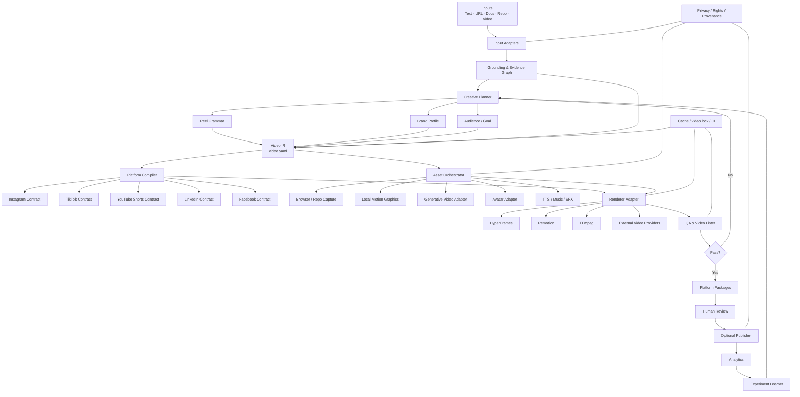

# Claude Video Studio: Deep Research on a Star-Worthy, Industry-Agnostic Short-Form Video Plugin

## Executive summary

**The opportunity is real, but “turn a prompt into a reel” is no longer enough.** By September 2026, the ecosystem already contains agent-native video renderers, Claude/agent skills for Remotion, prompt-to-video skills, long-video-to-short tools, browser-to-video workflows, AI avatars, automatic clipping, captions, and full prompt-to-video agents. HyperFrames, for example, is explicitly designed for agents, ships video-production skills, supports a website-to-video workflow, and produces deterministic renders; Remotion is positioning itself around agentic and programmatic video; HeyGen has a Video Agent that turns a prompt into a complete video; Descript and OpusClip already cover significant parts of repurposing, captions, resizing, clipping, and social publishing. citeturn22search3turn22search8turn14search0turn23search0turn23search1

So the product should **not** be positioned as:

> “A Claude Code plugin that generates videos.”

It should be positioned as:

> **A source-grounded, platform-aware video compiler for Claude Code: text, URLs, documents, repositories and existing footage in; tested, reproducible, multi-platform short-form video packages out.**

That distinction is the largest gap I found.

The core architectural insight is to make the **source of truth a structured intermediate representation—`video.yaml` / Video IR—not the final MP4 and not a giant prompt**. The plugin would compile the same Video IR into Instagram, TikTok, YouTube Shorts, LinkedIn and Facebook variants, applying platform constraints, brand rules, safe-zone rules, accessibility, caption behavior, covers, codec settings and publishing metadata. Rendering then becomes a replaceable backend: HyperFrames, Remotion, FFmpeg, avatar services or generative-video providers.

**On the earlier question, “Have we covered best practices for every kind of reel?” — no, and trying to enumerate every possible reel is the wrong architecture.** The world continuously invents new formats. The scalable solution is a three-layer system:

**Platform contract → Reel grammar → Style/industry pack.**

A “talking-head cybersecurity reel,” “restaurant listicle,” “real-estate property tour,” “developer product demo,” “medical explainer,” “fashion before/after,” and “financial data story” should all be combinations of reusable narrative and visual primitives rather than separate hard-coded prompts.

The most promising launch differentiators are:

1. **Video IR / compiler architecture** rather than one-shot prompting.
2. **A versioned social-platform specification registry** with a `video lint` command.
3. **Source-grounded scripts**, where factual claims can trace back to URLs, documents or repository files.
4. **Repo-to-reel**, including automatic browser/product capture.
5. **Visual QA and “video unit tests”** for safe zones, text overflow, contrast, captions, duration, crops, codecs and scene quality.
6. **Brand-as-code** covering typography, colors, motion, voice, caption behavior and forbidden treatments.
7. **Local-first mode**, so a useful video can be made without uploading proprietary documents/code or buying a video-generation API.
8. **A provider-neutral rendering and generation layer.**
9. **Rights/provenance and AI-disclosure automation**, including C2PA-compatible provenance.
10. **Variant/experiment manifests**, with eventual publishing and analytics feedback.
11. **Git-native reproducible builds**, visual diffs and CI/CD.
12. **Clean-room viral reverse engineering**, extracting structure and pacing from reference videos rather than cloning their creative assets.

This is materially different from the Claude video skills I found. Existing projects tend to specialize in a stage: prompting, Remotion craftsmanship, raw-video editing, long-to-short clipping, TikTok-style composition or a broad production toolkit. The reviewed ecosystem does contain increasingly broad offerings, especially HyperFrames and `claude-code-video-toolkit`, so the moat cannot simply be “many video tools in one repo.” The defensible gap is **compiler + constraints + QA + provenance + experiments + developer workflow**. citeturn21search2turn21search4turn9search2turn9search3turn9search6turn9search9

A particularly important finding is that **platform rules cannot safely be hard-coded as a single “Reels specification.”** Instagram's Content Publishing API currently allows Reel containers from 3 seconds to 15 minutes, while its iOS Reels sharing integration recommends 3–60 seconds. Facebook's consumer product has moved toward treating all videos as Reels without format or length restrictions, yet the Facebook Page Reels Publishing API still requires 3–90 seconds and 9:16. TikTok requires clients to query the creator's current `max_video_post_duration_sec`. Those inconsistencies justify a first-class **capability resolver** rather than a PDF of social-media dimensions. citeturn16search1turn16search5turn15search1turn16search2turn20search3

The recommended launch architecture is therefore:

> **Claude skill layer → source grounding → creative planner → Video IR → platform compiler → asset/provider adapters → renderer → automated QA → platform packages → optional publisher → analytics/experiments**

That is much more likely to become a reusable open-source infrastructure project than a collection of fashionable prompts.

## Platform contracts and the cross-platform design system

Platform support should be implemented as **versioned contracts**. Each contract should record the source URL, last-verified date, publishing route, hard constraints, recommended defaults and UI exclusion masks. This matters because “what the app allows,” “what the API allows,” and “what an ad product allows” are often different things.

The specifications below are verified against first-party documentation available on **September 25, 2026**.

| Platform | Current hard/API envelope | Aspect ratio and output | Captions/subtitles | Cover/thumbnail | What Claude Video Studio should do |
|---|---|---|---|---|---|
| **Instagram Reels** | Meta's current Instagram publishing endpoint specifies Reel video duration **3 seconds–15 minutes**, maximum **300 MB**, VBR up to **25 Mbps**, maximum horizontal dimension 1920 px. The API accepts a very broad aspect-ratio range but recommends **9:16** to avoid cropping/blank space. citeturn16search1 | Produce **1080×1920 9:16 MP4/H.264** as the plugin's standard social master. Treat that as the plugin's compatibility target, not as a claim that Instagram requires exactly 1080×1920. | Instagram publishing errors document **2,200 characters**, up to **30 hashtags** and **20 @ tags** for post captions. There is no comparable universal sidecar-caption workflow in the reviewed Reels publishing path, so burned-in subtitles should be the reliable default. citeturn16search7 | Reel cover: **JPEG, ≤8 MB, recommended 9:16**. If also shared to Feed, Meta crops the middle **1:1** region for that presentation. citeturn16search1 | Generate `cover-9x16.jpg` plus a center-square crop preview; lint important text against both crops. |
| **TikTok** | TikTok currently says videos recorded in-app can be up to **10 minutes** and uploaded videos up to **60 minutes**. For Direct Post, the plugin must query `max_video_post_duration_sec` because the allowed publishing duration is creator-specific. citeturn20search1turn20search3 | Use **1080×1920 9:16** as the production target. TikTok's current in-feed ad specification explicitly recommends 9:16 and at least 540×960 for vertical ad media; importantly, TikTok says its safe zone changes according to dimensions, caption length and additional UI formats. citeturn20search2 | Direct Post's `title`/caption field permits **2,200 UTF-16 runes**, including hashtags and mentions. The plugin should burn speech captions into the master because post text and speech subtitles are different concerns. citeturn20search0 | Direct Post exposes `video_cover_timestamp_ms`: TikTok can use a chosen video frame as the cover. citeturn20search0 | Deliberately compose a “cover-safe frame” into the timeline and select its timestamp rather than treating a thumbnail as an afterthought. |
| **YouTube Shorts** | A standard channel's square or vertical video of up to **3 minutes** is categorized as a Short when it meets YouTube's current rules. citeturn17search8 | **1080×1920 9:16** is an excellent plugin master; square is also eligible. YouTube's encoding guidance supports MP4/H.264 workflows and recommends preserving the source frame rate rather than resampling unnecessarily. | YouTube supports caption-track uploads through its Data API; the current `captions.insert` endpoint permits caption files up to **100 MB**. citeturn17search1turn17search3 | Verified accounts can now upload custom Shorts thumbnails through desktop Studio. YouTube recommends **2160×3840, 9:16**, with minimum height **640 px**, JPG/PNG, and a desktop upload ceiling of **50 MB**. citeturn17search0 | Produce both burned subtitles and an SRT/VTT-compatible caption artifact, plus a high-resolution 9:16 cover. |
| **LinkedIn** | LinkedIn's current Videos API specifies **3 seconds–30 minutes**, **75 KB–500 MB**, **MP4**. citeturn19view2turn19view3 | The cited Videos API exposes aspect-ratio metadata rather than mandating one universal feed ratio. For short-form vertical video, make **9:16** the plugin's default and allow 4:5/1:1/16:9 profiles when explicitly requested. | The current Videos API supports optional uploaded captions and thumbnails. Its present schema says one caption file per video and **English-language captions** through that path; SRT is demonstrated in the API documentation. citeturn18search0turn19view3 | Optional custom thumbnail; if omitted, LinkedIn can generate one. citeturn18search0 | Generate MP4 + burned subtitles + SRT + thumbnail, but let the publisher adapter inspect current caption-language capability. |
| **Facebook Reels** | Meta announced that new Facebook videos are being unified as Reels without consumer-facing length/format restrictions. **However**, the current **Facebook Page Reels API** remains much stricter: **3–90 seconds**, 9:16, minimum **540×960**, recommended **1080×1920**, **24–60 fps**. citeturn15search1turn16search2 | Page API: MP4 recommended; H.264/H.265, VP9 and AV1 supported; AAC-LC, 48 kHz stereo, audio bitrate 128 kbps or higher. citeturn16search2 | For maximum portability, burn subtitles and retain a caption sidecar in the output package rather than assuming every Facebook publishing route supports identical caption features. | Facebook's Page Reel workflow supports custom cover customization. citeturn16search2 | Capability negotiation is mandatory: `facebook-ui` and `facebook-page-api` should be separate targets. |

### The plugin should distinguish four things users currently mix together

A video's **spoken captions**, **burned subtitles**, **platform post caption**, and **cover/thumbnail text** should be separate fields in the Video IR.

For example:

```yaml
platform:
  instagram:
    post_caption: "Three things most teams miss..."
    hashtags: ["#productivity", "#saas"]

captions:
  mode: burned-and-sidecar
  source: narration
  speaker_labels: auto

cover:
  headline: "3 mistakes costing you hours"
  focal_time: 2.4
```

That one decision prevents a large class of bad automation.

### A universal production master

The default internal canvas should be:

| Token | Recommended Claude Video Studio default |
|---|---|
| Canvas | `1080 × 1920`, 9:16 |
| Internal FPS | `30 fps`, with 24/30/60 export profiles |
| Delivery codec | H.264 + AAC in MP4 |
| Grid | 8 columns |
| Base external margin | 72 px |
| Column gutter | 24 px |
| Baseline spacing unit | 8 px |
| Critical cross-platform content zone | approximately `x=72–900`, `y=180–1560` |
| Hook region | approximately `x=90–900`, `y=180–600` |
| Primary caption region | approximately `x=90–900`, `y=1260–1530` |
| Max caption lines by default | 2 |
| Cover master | 1080×1920; additionally generate platform-specific higher-resolution covers where needed |
| Text overflow policy | hard failure for hook/caption, warning for decorative copy |
| Caption collision policy | hard failure against face/UI/CTA masks |

Those coordinates are **Claude Video Studio design defaults, not official platform safe-zone requirements**. That distinction is important. TikTok itself documents that its safe zone changes with creative dimensions, caption length and UI treatment, which means a serious tool should maintain per-platform exclusion masks instead of perpetuating screenshots such as “always leave exactly 250 pixels at the bottom.” citeturn20search2

A better implementation is:

```text
1080x1920 Master
      │
      ├── Instagram UI mask
      ├── TikTok UI mask
      ├── YouTube Shorts UI mask
      ├── LinkedIn vertical-feed mask
      └── Facebook Reels UI mask
                │
                ▼
          Visual QA / Linter
```

Each mask can be updated independently through a small `platform-specs` package without releasing the entire renderer.

### Accessibility should be a build requirement

W3C's WCAG guidance requires synchronized captions for prerecorded audio content and explicitly notes that proper captions should represent meaningful non-dialogue information and speaker identification, not just spoken words. It also advises that captions should not obscure important video information. citeturn23search2

Accordingly, `video lint` should check:

```text
✓ speech has timed captions
✓ meaningful sound events can be represented
✓ captions do not cover detected faces or required UI controls
✓ no caption text leaves the safe region
✓ foreground/background contrast passes the configured threshold
✓ information is not conveyed only by red/green or another color pair
✓ extremely rapid flashing receives a warning
✓ subtitle line count and reading density are reasonable
✓ SRT/VTT sidecars match the final rendered dialogue
```

For the built-in visual system, I would make **4.5:1 for normal text and 3:1 for large display text** the default contrast-linter thresholds. Treat those as conservative accessibility house rules rather than platform-specific requirements.

## Reel grammar and visual design systems

The plugin should **not** have 200 independent prompts called `restaurant-reel`, `fintech-reel`, `dentist-reel`, `fashion-reel`, and so on.

It should have a composable grammar.

A reel can be represented as:

```text
Narrative
    Hook
      ↓
    Context / Problem
      ↓
    Insight / Demonstration
      ↓
    Evidence / Transformation
      ↓
    CTA / Loop-back

Visual Track
    A-roll + Screen + B-roll + Cards + Charts + Quotes + UI + Code

Audio Track
    Voice + Native Audio + Music + SFX

Platform
    Safe Zones + Duration + Cover + Metadata + Caption Contract

Brand
    Typography + Color + Motion + Voice + Logo + Do/Don't Rules
```

The first-party narrative primitives should include `hook`, `question`, `contrarian-claim`, `problem`, `story`, `step`, `proof`, `comparison`, `demo`, `reveal`, `objection`, `testimonial`, `result`, `CTA` and `loop-back`.

Visual primitives should include `a-roll`, `b-roll`, `screen-recording`, `product-ui`, `card`, `quote`, `stat`, `chart`, `code`, `split-screen`, `before-after`, `photo`, `generated-video`, `avatar`, `map`, `timeline`, `lower-third` and `kinetic-text`.

With those primitives, first-party templates can cover talking heads, podcast clips, faceless listicles, UGC-style ads, product demos, software walkthroughs, tutorials, before/after transformations, educational explainers, news summaries, case studies, testimonials, data stories, code demos, product launches, event recaps and “carousel-style” slide stories without hard-coding an industry.

The following should be the **built-in visual design defaults for a 1080×1920 composition**. They are design recommendations for Claude Video Studio rather than claims that social algorithms require these exact numbers.

| Reel type | Typography | Color system | Layout/text placement | Motion/pacing | Caption treatment |
|---|---|---|---|---|---|
| **Carousel-style / slide story** | Headline: **Inter/Manrope 88–104 px, 750–850**. Supporting: **46–58 px, 500–650**. Numerals may use 110–140 px. | Neutral `#F8FAFC` or `#0B0F19` base; one primary brand accent. Default accent `#2563EB`; optional emphasis `#F59E0B`. | Headline in upper third; one dominant idea per card; content aligned to 8-col grid; avoid more than 2 visual hierarchies simultaneously. | Card hold **1.4–2.2 s** default; entry motion **180–300 ms**; semantic element stagger **80–160 ms**. | Usually minimal speech captioning; when voiceover exists, captions sit below the principal card content rather than covering it. |
| **Talking-head / founder / podcast** | Hook: **80–96 px, 800**. Speech captions: **52–60 px, 700–800**. Lower third: **34–42 px**. Use **Inter or Noto Sans** for broad language support. | Preserve natural footage. Captions use high-contrast white/dark treatment and one brand accent for active phrases. | Face primarily within center/left critical area; leave right edge clear for platform controls. Caption region around y=1260–1510; move dynamically when hands/products occupy it. | Preserve natural speech; allow a crop change, B-roll, graphic or semantic emphasis around **2–4 s** when useful rather than adding arbitrary cuts. | Phrase-level captions, generally **3–7 words per unit**, max 2 lines; one highlighted keyword rather than karaoke-coloring every word by default. |
| **Screen demo** | Scene title **72–88 px, 750–800**. UI callout **36–44 px, 600–700**. Caption **46–54 px**. | Keep product colors intact; overlays derive from `brand.yaml`; use a dark/light scrim when callouts would otherwise disappear. | Screen recording occupies roughly 70–85% of useful canvas. Crop/zoom the relevant control rather than presenting a tiny full desktop. Keep annotation arrows/callouts outside the clicked control. | Cursor movement **300–700 ms**; action dwell **1–2 s**; important state change hold **1.5–3 s**. Zoom only when semantically useful. | Put narration subtitles outside the most important application region; UI labels should not compete with spoken captions. |
| **Product-UI showcase** | Product headline **72–92 px, 750–850**; feature labels **38–48 px, 600–700**; UI itself should remain legible after export. | Product's actual design tokens dominate. One external highlight token marks cursor/focus. Avoid recoloring product UI merely for “reel aesthetics.” | Device/browser frame centered; feature text appears in unused negative space; critical UI target is enlarged until readable on a phone. | Smooth state transitions **250–500 ms**; focus zoom around **1.4–2.0×**; pause after key result instead of continuously panning. | Captions can relocate top/bottom according to the UI's active area. Collision detection should be automatic. |
| **Animated explainer / data story** | Hook **84–108 px, 800**; body **48–60 px, 550–700**; chart labels **36–46 px**. Inter/Manrope/Noto Sans. | One base, one brand accent and semantic status colors. Starter dark palette: `#0B0F19`, `#F8FAFC`, `#2563EB`, `#10B981`, `#EF4444`, `#F59E0B`. | One focal point at a time. Charts occupy central 60–75% of usable width. Explanatory copy should stay outside the data marks it explains. | Typical semantic scene **2–4 s**; component motion **200–500 ms**; always allow a readable hold after the animation completes. | Captions should not duplicate large on-screen sentences verbatim when the same information is already visually obvious; use concise narration captions. |

A sixth built-in archetype should be **faceless/B-roll listicle**, because it is common across travel, consumer products, food, education, fitness, finance and news. A seventh should be **testimonial/case study**. An eighth should be **before/after/transformation**. The important design decision is that these are compositions of the same primitives rather than separate rendering engines.

### Brand profiles need more than colors and fonts

A useful `brand.yaml` should look more like this:

```yaml
brand:
  name: Acme

  typography:
    display:
      family: Inter
      weight: 800
    body:
      family: Inter
      weight: 550
    multilingual_fallback:
      family: Noto Sans

  colors:
    background: "#0B0F19"
    foreground: "#F8FAFC"
    primary: "#2563EB"
    accent: "#F59E0B"

  captions:
    family: Inter
    weight: 750
    active_word: false
    plate_opacity: 0.72
    max_lines: 2

  motion:
    personality: precise
    cut_density: medium
    springiness: low
    transition_duration_ms: 280

  voice:
    personality: clear-confident
    pace: medium
    banned_phrases:
      - "game changer"
      - "revolutionary"

  logo:
    max_screen_fraction: 0.08
    placement: top-left

  forbidden:
    - excessive_glow
    - random_emoji
    - fake_ui
    - flashing_text
```

That is much more valuable to teams than remembering “our blue is #2563EB.”

Motion personality should be a token just like color:

```text
precise
editorial
cinematic
energetic
playful
minimal
luxury
technical
documentary
ugc-native
```

The plugin then converts `motion.personality: precise` into concrete easing, durations, transitions and cut behavior appropriate to the selected renderer.

### Caption styling deserves its own engine

Do not implement captions as “add SRT text at the bottom.”

Use a caption layout engine with:

```text
word/phrase timestamps
speaker ID
semantic phrase grouping
punctuation-aware line breaking
face avoidance
UI avoidance
safe-zone awareness
RTL support
CJK-aware line breaking
brand typography
current-word emphasis
sound-effect annotations
burned / sidecar / both output
```

Whisper is a strong open-source baseline for multilingual speech recognition, translation and language identification; `faster-whisper` and `whisper.cpp` provide alternative local execution paths suited to different hardware/deployment preferences. citeturn22search2turn11search0turn10search7

The principle should be:

> **Captions are a responsive layout component, not pixels permanently anchored 150 px from the bottom.**

## OSS, Claude skills, APIs and competitor landscape

Anthropic's skill architecture is well suited to this project. Anthropic describes skills as self-contained folders with a `SKILL.md` containing instructions and metadata, dynamically loaded for specialized work; its official skills repository has grown into a very large ecosystem. Claude Code's plugin ecosystem also supports packaged skills, commands, agents and MCP integration, which means Video Studio can expose both high-level commands and reusable specialized skills rather than one monolithic system prompt. citeturn21search6turn9search0

### Recommended open-source and Claude-native building blocks

Star counts are approximate snapshots from the pages observed during this research on September 25, 2026 and will naturally change.

| Project / tool | What it contributes | Recommendation |
|---|---|---|
| `anthropics/skills` | Official Agent Skills examples/spec patterns; roughly **177k–178k stars** in the current GitHub snapshot. Skills are self-contained and use `SKILL.md`. citeturn21search0turn21search6 | **Foundation.** Follow its skill conventions rather than inventing a parallel prompt system. |
| `anthropics/claude-plugins-official` | Official Claude Code plugin/marketplace patterns including plugin metadata, commands, skills, agents and MCP configuration. citeturn9search0 | **Foundation.** Package Video Studio as a real plugin with independently loadable skills. |
| `heygen-com/hyperframes` | Agent-first HTML/CSS video composition, deterministic headless-browser + FFmpeg rendering, CLI lint/preview/render, reusable catalog and agent skills. It also has a `website-to-hyperframes` workflow. Apache-2.0. citeturn22search3turn22search11 | **Best default renderer candidate.** Agent-native, deterministic and CI-friendly. |
| `remotion-dev/remotion` | React-as-video source of truth, programmable composition, batch rendering, agent skills, captions and broad ecosystem; current GitHub snapshot is around **60k stars**. It has a special commercial-license model in some cases. citeturn22search8 | **Excellent optional renderer.** Do not make it the only backend because of licensing and stack coupling. |
| `FFmpeg/FFmpeg` | Core audio/video/subtitle/filter/encoding toolkit; around **64.5k stars** in the observed snapshot. citeturn22search9 | **Mandatory low-level layer** for probing, encoding, muxing, cropping, audio and delivery validation. |
| `openai/whisper` | Multilingual ASR, translation and language identification; about **110k stars**, MIT licensed. citeturn22search2 | Baseline transcription backend. |
| `ggerganov/whisper.cpp` | Lightweight C/C++ Whisper implementation suited to local execution. citeturn10search7 | Great “privacy/local laptop” transcription backend. |
| `SYSTRAN/faster-whisper` | CTranslate2-based Whisper implementation aimed at faster/lower-memory inference; current observed GitHub footprint was about **25k stars**. citeturn11search0 | Good server/GPU transcription backend. |
| `hexgrad/kokoro` | Lightweight/open-weight local TTS implementation. citeturn11search6 | Local/default synthetic voice option where its license/model terms fit. |
| ElevenLabs API/SDK | High-quality commercial TTS and voice workflows with multiple voice/audio options. citeturn12search0turn12search1 | Optional premium TTS adapter. Never require it for basic usage. |
| `heygen-com/hyperframes` + `heygen-com/skills` / HeyGen API | Open-source renderer on one side; commercial Avatar/Video Agent/translation APIs on the other. HeyGen's Video Agent can produce a complete video from a prompt; Avatar APIs handle avatar video; translation supports dubbing/lip-sync workflows. citeturn13search5turn14search0turn14search1turn14search2 | Optional avatar/localization provider. Keep renderer and cloud-avatar functionality conceptually separate. |
| `sunfjun/claude-skill-ai-video-prompt` | Claude skill implementing a six-part AI-video prompt structure: subject, action, frame constraints, camera, lighting/color and timeline, targeting Sora/Runway/Kling/Veo/Pika/etc. citeturn21search2 | Useful inspiration for a **provider prompt adapter**, but not enough to be the product itself. |
| `cclank/lanshu-awesome-ai-video-kit` | Large prompt/methodology collection covering numerous commercial/open video models and Claude skills. citeturn21search5 | Useful reference for provider-specific prompt dialects and model selection. |
| `digitalsamba/claude-code-video-toolkit` | Broad AI-native Claude Code production toolkit incorporating Remotion knowledge, FFmpeg, ElevenLabs, Playwright recording and other generation/editing paths. citeturn21search4 | **Important competitor/reference.** Our design needs to differentiate above “many video skills bundled together.” |
| `haidrrrry/claude-remotion-skill` | Claude/Remotion motion-graphics workflow, including render/inspect/fix iteration and caption/video craft. citeturn9search2 | Study its creative QA loop. |
| `saucetech/ai-video-editor` | Claude Code-oriented vertical reel editing: transcription, trimming, captions, FFmpeg and related post-production. citeturn9search3 | Reference for raw-footage → finished-reel workflow. |
| `iart-ai/tiktok-video-skills` | Short-form and TikTok-oriented agent skills for captions, lower thirds and video patterns. citeturn9search6 | Good short-form grammar reference. |
| `fnusatvik07/reelgen` | Long talk/screen-share → vertical reels, using transcription/FFmpeg workflows. citeturn9search9 | Reference for long-to-short extraction and screen/slides preservation. |

A key technical decision follows from this audit: **do not reimplement rendering, FFmpeg, transcription or generic AI-video prompting from scratch.** The differentiated value belongs one layer above them.

### Commercial competitor comparison

The following matrix reflects publicly documented capabilities, not every private or experimental feature a vendor may have.

| Product | Strong today | What remains open for Claude Video Studio |
|---|---|---|
| **Descript** | Text-based video editing, transcription, screen recording, clips, captions, AI enhancement, generated media, translation and resizing/reformatting for social destinations. citeturn23search0turn23search4 | Not positioned as a Git-native compiler for URL/doc/repo evidence, deterministic build manifests, platform spec tests and CI. |
| **OpusClip** | Long-video → multiple shorts, AI clipping, captions, reframing, B-roll, audio enhancement, voiceover and social publishing. citeturn23search1 | Very strong for repurposing existing footage; less aligned with “knowledge/repository → source-grounded software-defined video.” |
| **HeyGen Video Agent** | Prompt → script/avatar/voice/scenes/full video and strong avatar/translation capabilities. citeturn14search0turn14search1turn14search2 | Claude Video Studio should be provider-neutral, locally usable and testable rather than becoming another single-cloud generation surface. |
| **HyperFrames** | Agent-native deterministic video rendering, HTML-native compositions, CLI, linting, catalog components, CI suitability and website-to-video. citeturn22search3turn22search11 | Use it underneath Video Studio; differentiate with source grounding, reel grammar, social contracts, experiments, provenance and publishing/analytics. |
| **Remotion** | Mature React/programmatic-video ecosystem, agent support, composition, automation and large community. citeturn22search8 | Video Studio should compile *to* Remotion rather than compete as another rendering framework. |
| **Current Claude video skills** | Prompt creation, Remotion patterns, raw footage editing, reels extraction, TikTok patterns and increasingly broad production toolkits. citeturn21search2turn21search4turn9search2turn9search3turn9search6turn9search9 | No reviewed project documented the complete combination of source lineage + Video IR + platform capability contracts + cross-renderer compilation + accessibility/rights QA + experiment loop + Git CI. |

That final row should be worded carefully: it is a conclusion from the **reviewed public projects**, not proof that no unreleased/private tool has those capabilities.

## The star-worthy gap and differentiated feature set

The gap is best described as **“video engineering”** rather than “AI video generation.”

Software developers have compilers, linters, tests, lock files, CI, package managers, reproducible builds and dependency abstractions.

Social-video production usually still has:

```text
prompt
   ↓
mysterious AI output
   ↓
manual fixes
   ↓
export
   ↓
hope it fits TikTok
```

Claude Video Studio can introduce software-engineering discipline:

```text
source
  ↓
evidence graph
  ↓
story
  ↓
typed Video IR
  ↓
platform compiler
  ↓
render backend
  ↓
video tests
  ↓
artifact package
  ↓
experiment
  ↓
metrics
```

That is a much more compelling GitHub story.

### The features that should define the repository

| Feature | Why it matters / differentiation | Implementation notes | External dependency/API | Complexity | Priority |
|---|---|---|---|---|---|
| **Video IR (`video.yaml`)** | Creates a stable contract between creative reasoning and rendering; enables multiple renderers and platform variants. | JSON Schema/Zod; scenes, tracks, claims, assets, captions, platform overrides, brand and provenance. | None | **High** | **P0** |
| **Versioned Platform Contract Registry** | Eliminates stale “Instagram dimensions” prompt lore. Handles route-specific contradictions such as Facebook consumer Reels vs Page API and TikTok account-specific duration. citeturn15search1turn16search2turn20search3 | `platforms/instagram-2026-09.yaml`; include source, verified date, hard/soft rules, safe-zone masks, metadata. | Platform docs/APIs | **Medium** | **P0** |
| **`video lint`** | A memorable GitHub-native feature competitors rarely foreground. | FFprobe + frame sampling + DOM/layout metadata + vision model optional. Validate duration, codec, ratio, safe zones, text overflow, captions, cover crop, silence, contrast. | FFmpeg; optional Claude vision | **Medium** | **P0** |
| **Source-Grounded Story Compiler** | Makes docs/URLs/repos materially different from generic prompt-to-video. | Build claim nodes pointing to source chunks/files/lines; every factual narration sentence can carry `claim_refs`. | Claude; URL/document parsers | **High** | **P0** |
| **Brand-as-Code** | Enables repeatable professional output across creators/teams. | `brand.yaml` with typography, colors, motion tokens, captions, voice, logo and forbidden patterns. | None | **Medium** | **P0** |
| **Reel Grammar / Archetype Engine** | Scales to “any industry” without hundreds of brittle prompts. | Narrative and visual primitives + community style packs. | None | **Medium** | **P0** |
| **Multi-renderer abstraction** | Avoids vendor lock-in and makes the repo infrastructure rather than one rendering template. | `RendererAdapter` interface; HyperFrames default; Remotion and FFmpeg adapters. | HyperFrames/FFmpeg/Remotion | **High** | **P0** |
| **Repo-to-Reel / Product Demo Agent** | Particularly compelling to the GitHub audience: README/repo → actual working demo reel. | Inspect repo, identify start command, launch isolated environment, Playwright record actual UI, crop actions, add callouts. Never invent UI screens. | Browser/Playwright | **High** | **P0/P1** |
| **Local-first Privacy Mode** | Critical when input is source code, unreleased products, contracts or enterprise documents. | Default deny on `.env`, secrets, credentials; external-provider allowlist; redact before network calls; local ASR/TTS/render. | Whisper/whisper.cpp/Kokoro | **Medium** | **P0** |
| **Provider-neutral AI-video adapter** | Lets users bring Veo, Kling, Sora, Runway or future models without rewriting story logic. | Capability model: text-to-video, image-to-video, max duration, resolution, audio, reference image, continuation. | User-selected APIs | **High** | **P1** |
| **Responsive Caption Engine** | Much better than fixed-position SRT rendering and directly addresses accessibility. W3C emphasizes synchronized and semantically complete captions. citeturn23search2 | Phrase grouping, face/UI avoidance, multilingual line breaking, speaker/sound labels, burned + sidecar. | Whisper backend | **High** | **P0** |
| **Localization/Dubbing Compiler** | Makes “any industry in the world” credible. | Translate script + regenerate timings/layout; RTL/CJK; optional voice cloning/lip sync. | Local TTS, ElevenLabs, HeyGen | **High** | **P1** |
| **Clean-room Viral Reverse Engineering** | Useful without turning the product into a content copier. | Analyze user-supplied/authorized reference video for hook form, shot length, text density, pacing, caption position, audio beats and narrative arc. Recreate structure, not copyrighted assets/script. | Whisper + optional vision | **High** | **P1** |
| **Experiment Manifest / A-B Variants** | Converts creative generation into measurable optimization. | Variants modify hook, cover, first five seconds, CTA, visual cadence; persist hypothesis + IDs + publish time + results. Instagram's publishing stack now exposes Trial Reels support, making at least one platform especially interesting for controlled experimentation. citeturn6search2 | Platform APIs | **High** | **P1** |
| **Publishing Capability Resolver** | Correctly handles API approval, account and route differences rather than promising “post everywhere.” | Adapter queries current capabilities before publishing. TikTok requires `video.publish` approval and unaudited clients are restricted; LinkedIn access has developer-program tiers. citeturn20search3turn18search8 | Meta/TikTok/YouTube/LinkedIn APIs | **High** | **P1** |
| **Analytics Feedback Layer** | Closes the loop from “generate” to “learn.” TikTok's current Video Object exposes views/likes/comments/shares; LinkedIn's current Community Management APIs expose video watch time/views/viewers; Instagram exposes view-count information for professional-media discovery. citeturn20search9turn18search5turn16search6 | Normalize metrics into a common schema without pretending platforms measure the same thing identically. | Social APIs | **High** | **P1/P2** |
| **AI Disclosure + Provenance** | Increasingly important for synthetic footage/voices. TikTok Direct Post has `is_aigc`; Meta added Content Publishing API support for self-disclosure of AI-generated content in 2026. citeturn20search0turn16search8 | Asset provenance ledger, provider/model, source license, consent status, platform disclosure map. Optional C2PA signing. | Platform APIs/C2PA | **Medium** | **P0/P1** |
| **Video CI/CD + Visual Regression** | This may be the most GitHub-native differentiator of all. HyperFrames itself emphasizes deterministic rendering and CI/regression suitability. citeturn22search3turn22search11 | `video.lock`, cached generated assets, golden frames, pixel/semantic diffs, PR artifact and QA report. | GitHub Actions + renderer | **Medium** | **P0** |

### The genuinely novel modules

The features I would make central in the README are **not** “AI script writer,” “caption generator,” or “Sora prompts.” Those are already commodities.

The hero features should be:

```bash
/video:create README.md --platform all
/video:demo ./my-app
/video:adapt launch.video.yaml --platform tiktok,linkedin
/video:lint dist/launch-instagram.mp4 --platform instagram
/video:test launch.video.yaml
/video:diff launch@v1 launch@v2
/video:variants launch.video.yaml --hooks 5 --covers 3
```

The README headline could therefore be:

> **Compile anything into short-form video.**
>
> Text, URLs, documents, repositories and footage → source-grounded Video IR → tested Instagram, TikTok, Shorts, LinkedIn and Facebook outputs.

That is much more distinctive than:

> AI video generator for Claude.

### A powerful second gap: truth and provenance

For document/repository input, each statement should be able to answer:

```text
Why did the video say this?
```

Example:

```yaml
claims:
  - id: claim_07
    text: "The SDK supports resumable uploads."
    source:
      type: repository
      file: docs/upload.md
      lines: [41, 58]

scenes:
  - id: scene_04
    narration: "The SDK also supports resumable uploads."
    claim_refs: [claim_07]
```

Then the plugin could support:

```bash
vstudio verify launch.video.yaml
```

and return:

```text
PASS  12/12 factual claims have source evidence
WARN  2 marketing claims are interpretive
PASS  No unsupported numerical claims
```

For technical, scientific, financial, medical, enterprise and news content, this becomes far more valuable than a “viral caption score.”

### A third gap: rights-aware generation

Every asset should carry:

```yaml
asset:
  id: broll_12
  origin: generated
  provider: example-provider
  model: model-x
  license_status: generated_by_user
  person_consent: not_applicable
  ai_disclosure: required
  hash: sha256:...
```

C2PA defines a technical framework around claims, manifests, bindings, cryptographic signatures and provenance metadata; it is a natural optional output layer for a serious media compiler. citeturn23search3

For reference-video analysis, do **feature extraction rather than copying**:

```text
Reference:
"fast jump cuts, 3-word hook, yellow captions, celebrity clip"

Extract:
hook_type = provocative_question
mean_shot_length = 1.8s
caption_density = high
caption_position = lower-middle
visual_energy = high
narrative = hook → evidence → reversal → CTA

Do NOT extract:
verbatim script
logo
music recording
creator's face
copyrighted B-roll
distinctive branded assets
```

That makes “viral reverse engineering” substantially more defensible and reusable.

## Recommended architecture and Claude plugin interface

The architecture should treat Claude as the **creative planner and reasoning layer**, not as the rendering engine.



A production run should look like this:


### Video IR is the architectural center

A simplified manifest could be:

```yaml
version: 1

project:
  id: launch-video
  title: "Product launch"
  objective: awareness

source:
  - type: url
    uri: "https://example.invalid/product"
  - type: repository
    path: "./"

audience:
  role: software-developer
  awareness: problem-aware

brand:
  profile: "./brand.yaml"

creative:
  archetype: product-demo
  narrative:
    - hook
    - problem
    - demo
    - proof
    - cta

master:
  width: 1080
  height: 1920
  fps: 30

scenes:
  - id: hook
    duration: 3.2
    narration: "Stop writing this integration by hand."
    visual:
      type: kinetic-text

  - id: demo
    duration: 12.0
    narration: "Point the CLI at your repository..."
    visual:
      type: browser-capture
      recording: assets/demo.webm
      focus:
        selector: "[data-testid='create-button']"

captions:
  mode: burned-and-sidecar
  style: brand
  avoid_faces: true
  avoid_ui: true

platforms:
  instagram:
    enabled: true
  tiktok:
    enabled: true
  youtube-shorts:
    enabled: true
  linkedin:
    enabled: true
  facebook:
    enabled: true

provenance:
  enabled: true
```

This representation is the main reason the system can eventually support dozens of renderers, styles, industries and platforms without turning into prompt spaghetti.

### Default renderer choice

I would make:

> **HyperFrames + FFmpeg = default open-source render path**  
> **Remotion = first-class optional adapter**

HyperFrames is explicitly HTML-native, agent-oriented, deterministic, CLI-friendly, Apache-2.0 licensed and designed for automated pipelines; it already supports lint, preview and render workflows. citeturn22search3turn22search11

Remotion is exceptionally mature for code-driven video and has a much larger ecosystem, but its repository explicitly warns that its special license requires a company license in some commercial situations. Keeping it optional avoids making the licensing model of one renderer the licensing model of Claude Video Studio. citeturn22search8

FFmpeg remains underneath both for probing, media manipulation, codecs, filters, scaling, subtitles, audio processing and validation. citeturn22search9

### Claude Code plugin structure

Anthropic's current ecosystem supports a plugin structure containing skills and other plugin components, while the Agent Skills model uses a folder with `SKILL.md` instructions and metadata. citeturn9search0turn21search6

A clean repository could be:

```text
claude-video-studio/
│
├── .claude-plugin/
│   └── plugin.json
│
├── commands/
│   ├── video-create.md
│   ├── video-adapt.md
│   ├── video-demo.md
│   ├── video-analyze.md
│   ├── video-lint.md
│   ├── video-test.md
│   ├── video-variants.md
│   └── video-publish.md
│
├── skills/
│   ├── video-director/
│   │   └── SKILL.md
│   ├── reel-grammar/
│   │   └── SKILL.md
│   ├── storyboard/
│   │   └── SKILL.md
│   ├── platform-compiler/
│   │   └── SKILL.md
│   ├── visual-design/
│   │   └── SKILL.md
│   ├── video-prompt-engineer/
│   │   └── SKILL.md
│   ├── repo-demo/
│   │   └── SKILL.md
│   ├── accessibility/
│   │   └── SKILL.md
│   └── video-qa/
│       └── SKILL.md
│
├── packages/
│   ├── video-ir/
│   ├── platform-specs/
│   ├── renderer-core/
│   ├── renderer-hyperframes/
│   ├── renderer-remotion/
│   ├── renderer-ffmpeg/
│   ├── captions/
│   ├── transcription/
│   ├── providers/
│   ├── publishing/
│   ├── analytics/
│   └── provenance/
│
├── templates/
│   ├── talking-head/
│   ├── product-demo/
│   ├── carousel-story/
│   ├── animated-explainer/
│   ├── faceless-listicle/
│   └── case-study/
│
├── platform-specs/
│   ├── instagram.yaml
│   ├── tiktok.yaml
│   ├── youtube-shorts.yaml
│   ├── linkedin.yaml
│   └── facebook.yaml
│
└── examples/
```

A minimal `skills/video-director/SKILL.md`:

```markdown
---
name: video-director
description: >
  Convert text, URLs, documents, repositories, or existing media into
  production-ready short-form video projects. Use this skill when the
  user asks for a reel, short, product demo, social video, explainer,
  talking-head edit, or multi-platform adaptation.
---

# Video Director

## Core rule

Never render directly from an unstructured prompt.

Always produce or update a valid Video IR project first.

## Workflow

1. Inspect the input source.
2. Determine objective, audience and desired platforms.
3. Extract factual claims and retain source references.
4. Select a narrative archetype using the reel-grammar skill.
5. Generate multiple hook candidates.
6. Choose or infer the visual archetype.
7. Create the storyboard and Video IR.
8. Resolve assets.
9. Generate narration and timed captions.
10. Compile platform-specific variants.
11. Render a preview.
12. Run video lint.
13. Fix blocking issues.
14. Render final platform packages.

## Required quality gates

- No unsupported factual claims.
- No text outside platform-safe regions.
- No unreadable UI.
- No caption collisions.
- No missing speech captions unless explicitly disabled.
- No silent or missing required assets.
- No platform duration/codec violation.
- Preserve source and asset provenance.

## Output package

For each enabled platform create:

- MP4
- cover/thumbnail
- post metadata
- SRT/VTT where supported
- video.yaml
- qa-report.json
- provenance.json
```

The plugin's specialized platform skill should **read current platform contracts rather than contain numerical requirements in prose**. That prevents outdated `SKILL.md` files.

### CLI and Claude command design

Natural Claude usage:

```text
/video:create https://example.com/product

/video:create ./whitepaper.pdf --type animated-explainer

/video:demo ./ --platform instagram,tiktok,youtube-shorts

/video:create README.md --duration 45s --brand brand.yaml

/video:adapt launch.video.yaml --platform linkedin

/video:analyze reference.mp4

/video:variants launch.video.yaml --hooks 5 --covers 3

/video:lint dist/launch-instagram.mp4 --platform instagram

/video:test launch.video.yaml

/video:publish launch.video.yaml --dry-run
```

The standalone CLI should mirror Claude commands:

```bash
vstudio create ./README.md \
  --type repo-demo \
  --platform instagram,tiktok,youtube-shorts \
  --brand ./brand.yaml

vstudio render launch.video.yaml

vstudio lint launch.video.yaml --platform all

vstudio test launch.video.yaml

vstudio variants launch.video.yaml \
  --hook-count 5 \
  --cover-count 3

vstudio package launch.video.yaml \
  --platform all
```

A successful run should produce something like:

```text
dist/
├── instagram/
│   ├── video.mp4
│   ├── cover.jpg
│   ├── caption.txt
│   └── qa.json
├── tiktok/
│   ├── video.mp4
│   ├── post.json
│   └── qa.json
├── youtube-shorts/
│   ├── video.mp4
│   ├── thumbnail.png
│   ├── captions.srt
│   └── metadata.json
├── linkedin/
├── facebook/
├── storyboard.html
├── video.yaml
├── video.lock
└── provenance.json
```

### `video.lock` could be a surprisingly important feature

Generation APIs are nondeterministic. Rendering can still be reproducible after generated assets are obtained.

A lock file can record:

```yaml
render:
  engine: hyperframes
  version: 1.x
  ffmpeg: "..."

assets:
  clip_07:
    sha256: "..."
    origin: generated
    provider: provider-x
    model: model-y
    prompt_hash: "..."

voice:
  engine: local
  model: "..."

platform_specs:
  instagram: "2026-09-25"
  tiktok: "2026-09-25"
```

Then a GitHub Action can distinguish:

```text
creative content changed
renderer changed
platform spec changed
external generated asset changed
only metadata changed
```

That is the sort of detail developers may star a repository for even when they already have access to CapCut, Descript or Sora.

## Roadmap and prioritized MVP

The strongest launch strategy is **not** to build every API integration before release. Direct publishing carries considerable authentication, approval and account-specific complexity: TikTok requires appropriate scopes and audits for unrestricted Direct Post, and LinkedIn's Community Management integration has access tiers and approval procedures. citeturn20search3turn18search8

The repository should therefore first become the **best way to create, compile and validate social video locally**, then layer distribution and analytics on top.

### Launch MVP

| Priority | Deliverable | Why it belongs at launch |
|---|---|---|
| **P0** | `/video:create` for text, URL, Markdown/PDF/docs and repository context | Establishes the universal input promise. |
| **P0** | Typed `video.yaml` Video IR | Architectural foundation and long-term moat. |
| **P0** | Reel grammar with at least talking-head, carousel-story, product-demo, product-UI, animated-explainer, faceless-listicle, case-study and before/after archetypes | Answers the “any industry” requirement without industry-specific hard-coding. |
| **P0** | Instagram/TikTok/YouTube Shorts/LinkedIn/Facebook platform contracts | Makes cross-platform compilation real. |
| **P0** | HyperFrames + FFmpeg default rendering | Allows an entirely local, deterministic motion-graphics workflow. HyperFrames is designed around agent-driven production and deterministic rendering. citeturn22search3 |
| **P0** | Local transcription using Whisper backend(s) | Enables captions and footage workflows without cloud dependency. citeturn22search2 |
| **P0** | Local TTS option + pluggable premium TTS | Makes the “hello world” video possible without requiring a paid provider. |
| **P0** | `brand.yaml` | Makes output professionally repeatable. |
| **P0** | Dynamic caption engine | Major visible quality improvement. |
| **P0** | `video lint` + `video test` | Signature developer feature. |
| **P0** | Cover/thumbnail compiler | Necessary for actual production readiness, not just rendering. |
| **P0** | Source-claim lineage | Strong differentiator for URLs/docs/repos. |
| **P0** | Local/private execution mode and secret guard | Essential for repositories and enterprise documents. |
| **P0** | `provenance.json` + AI-disclosure flags | Builds trust into the architecture before providers proliferate. |
| **P0** | GitHub Action that renders and lints examples | Makes “video as code” visible immediately. |
| **P0/P1** | Basic repo-to-browser demo capture | Potentially the strongest GitHub-user acquisition feature. |

The default first-run experience should require **no generative-video API key**. For example:

```bash
/plugin install video-studio@claude-video-studio
```

then:

```text
/video:create README.md --platform youtube-shorts
```

could produce a polished motion-graphics/product explainer using HTML, browser capture, local TTS, captions and FFmpeg. Only cinematic generative B-roll, premium voices or avatars would require external accounts.

That matters because the current Claude skills ecosystem makes installation and natural-language invocation relatively straightforward; users will compare the plugin's friction against similarly simple skill installs. citeturn21search2turn21search6

### Expansion release

The next layer should add:

**Repo-to-demo depth:** application launching, Playwright interaction planning, cursor choreography, responsive device modes, automatic zooms, secret redaction and “actual UI only” safeguards.

**Provider adapters:** external video-generation providers exposed behind capabilities rather than hard-coded prompt files. A provider declaration should describe text-to-video, image-to-video, reference-image, audio, duration, resolution, extension and continuation capabilities. The AI-video-prompt skill ecosystem already illustrates why provider prompt dialects differ. citeturn21search2turn21search5

**Avatar and localization:** optional HeyGen avatar/video translation and ElevenLabs voice adapters while retaining local alternatives. HeyGen currently provides dedicated avatar-video and translation APIs in addition to its Video Agent. citeturn14search0turn14search1turn14search2

**Reference analysis:** clean-room `/video:analyze reference.mp4`, producing a structured creative profile:

```yaml
hook:
  type: contrarian_statement
  onset_ms: 120

editing:
  median_shot_duration: 1.9
  pattern_interrupt_density: high

captions:
  position: lower-middle
  words_per_phrase: 4
  active_word_emphasis: true

visual:
  composition: talking-head-plus-broll
  energy: high

story:
  - hook
  - problem
  - evidence
  - reversal
  - cta
```

This profile can then be used to create a new, unrelated piece with a similar production grammar.

### Distribution and learning release

Add official publishing adapters only after core creation is excellent.

The publisher should run:

```text
authenticate
   ↓
query platform/account capabilities
   ↓
validate current contract
   ↓
show planned metadata/disclosures
   ↓
explicit user approval
   ↓
publish
   ↓
persist returned post ID
```

This is particularly important on TikTok, where Direct Post requires querying creator information—including current duration capability and privacy options—before publishing, and the API provides an explicit `is_aigc` disclosure flag. citeturn20search0turn20search3

Then build the experiment loop:

```text
                       ┌── Hook A ── Cover A
Original Video IR ─────┼── Hook B ── Cover B
                       └── Hook C ── Cover C
                                │
                                ▼
                        Platform publishing
                                │
                                ▼
                         Normalized metrics
                                │
                                ▼
                       Experiment report
                                │
                                ▼
                       Next creative brief
```

Do not invent a universal “virality score.” TikTok views, YouTube Shorts behavior, LinkedIn watch-time metrics and Instagram engagement are different measurement systems. Store original platform metrics and calculate derived metrics explicitly. LinkedIn, for example, currently exposes video watch time, views and viewers through its Community Management analytics capabilities, while TikTok's Video Object includes views, likes, comments and shares. citeturn18search5turn20search9

### What should make people star the GitHub repository

The project's GitHub story should center on a **visible technical breakthrough**, not a feature count.

A compelling README sequence would be:

```text
1. Give Claude a GitHub repo.
2. Claude understands the product.
3. It launches and records the real app.
4. It produces video.yaml.
5. It generates voice/captions.
6. It renders a 45-second product reel.
7. video lint catches a subtitle behind TikTok controls.
8. Claude fixes it.
9. One source compiles into five platform packages.
10. GitHub Actions reproduces the same build.
```

That is the demo.

A second demo:

```text
whitepaper.pdf
     ↓
source-grounded explainer
     ↓
every factual statement traceable to source
     ↓
English / Hindi / Japanese variants
     ↓
accessibility + platform QA
```

A third demo:

```text
raw-founder-interview.mp4
     ↓
three candidate shorts
     ↓
hook variants
     ↓
captions + b-roll + covers
     ↓
experiment manifest
```

Those three examples prove that Claude Video Studio is not tied to SaaS, MSB Docs, influencers or any single industry.

The repository should also launch with a **template/provider extension API** so community contributions are easy:

```text
community/
├── archetypes/
│   ├── recipe-video/
│   ├── real-estate-tour/
│   ├── education-whiteboard/
│   └── developer-demo/
├── styles/
│   ├── editorial/
│   ├── minimal/
│   ├── cinematic/
│   └── ugc-native/
├── providers/
└── platform-packs/
```

A creator should be able to contribute a **style**, not fork the entire renderer.

The final strategic recommendation is therefore:

> **Do not build the world's largest collection of reel prompts.**
>
> Build the first serious **open, testable short-form video compiler for coding agents**.

The prompt is temporary.

The rendering provider is replaceable.

The current viral editing style will change.

The platform rules will change.

But the durable abstraction is:

```text
SOURCE
  ↓
TRUTH
  ↓
STORY
  ↓
VIDEO IR
  ↓
DESIGN SYSTEM
  ↓
PLATFORM COMPILER
  ↓
RENDERER
  ↓
TESTS
  ↓
VIDEO
  ↓
METRICS
```

That is the gap most worth building around.